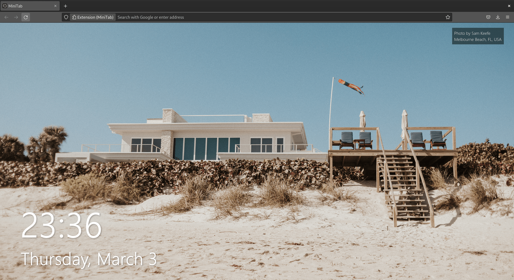
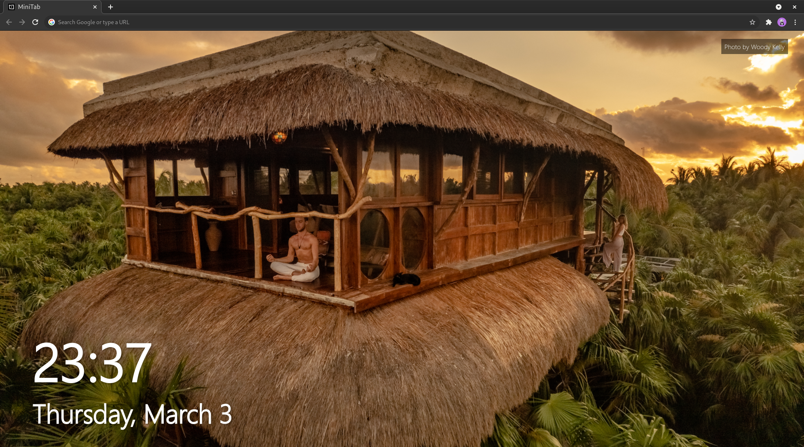

# MiniTab


## Scripts

You need to have elm installed. Run the build script using

```bash
elm make ./src/Main.elm --output=./dist/js/main.js
```

Run the clean script using

```bash
rm -rf dist/main.js
```

## Required File

Before running the build script you need to have a the following in `src/ClientId.elm`

```elm
module ClientId exposing (..)


getClientId : String
getClientId =
    "<CLIENT-ID>"
```

You can get a client id from [unsplash](https://unsplash.com/developers).

## Extension

This is also an extension you can load it to your browser and it will override the default new tab page.
The manifest file is at `dist/manifest.json`.

Build the package using this script

```bash
web-ext build -s ./dist/
```

## Screenshots



