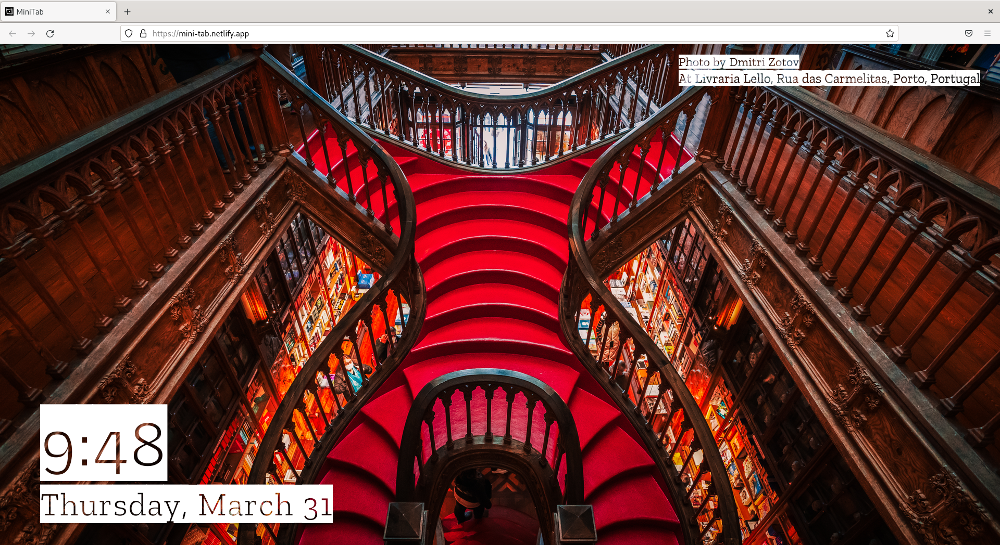

# MiniTab


A beautiful new tab website that shows time and a random image from unsplash.

## Screenshots

Sample screenshots of the website



## Running the website

Install packages using.

```bash
pnpm install
```

Run the `start` script.

```bash
pnpm start
```

## Requirements

This code expects an environment variable called `CLIENT_ID` to be defined. To provide this environment variable create a file called `.env` containing the following content:

```dotenv
CLIENT_ID="<CLIENT-ID>"
```

You can get your client id from [unsplash](https://unsplash.com/developers).
